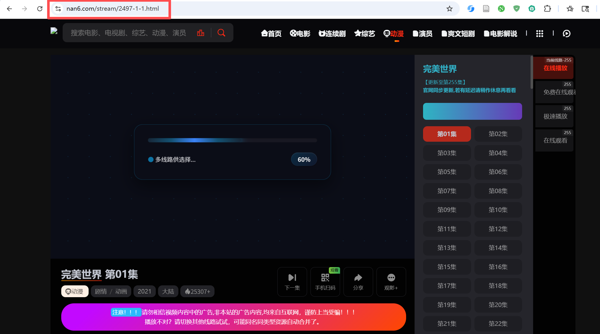
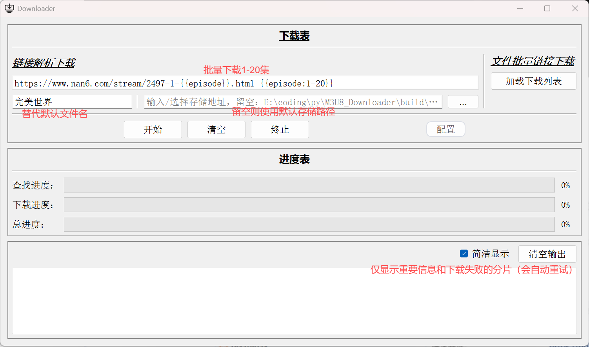

# m3u8 网络视频下载器

## 项目简介

实现了一个图形化的 m3u8 下载器。
核心价值：
- 大多数“非官方”“非主流”的视频网站都能下载，因为它们都是用 m3u8 格式进行分片播放。这代表这你想看某个电视剧/番剧，你多半可以找到非官方的播放源，只要你能找到，90%的我的默认配置都能给他下载下来，95%的你自定义一下配置也能下载下来，个人认为这完全够用了，实在下载不了就换一个播放源。
- 支持直接输入 m3u8 地址下载；支持输入网址嗅探 m3u8 资源并下载；支持批量下载。这代表着多集的电视剧/番剧，你把程序跑着就能自己下载，过段时间你再来看已经下载完了。
- 部分网站的视频只能预览，但是有的网站写得很蹩脚，预览是...preview.m3u8,正式视频是...index.m3u8,所以我只要改地址原先只能预览的视频我就能看完整版了（我确实碰到过这样的网站，只不过比较少就是了，万一你就碰到了呢:-)）
- 下载过程中分片并保留下载日志。

## 界面说明

### 主界面

主界面可分为 3 个区域：

- `链接解析下载`：输入网页 URL 或 m3u8 URL，并可选填写文件名和存储目录。
- `文件批量链接下载`：通过 `加载下载列表` 读取历史日志（`Data/*.json`）继续任务。
- `进度表 + 输出区`：查看查找进度、下载进度、总进度，以及运行日志。

常用按钮含义：

- `开始`：启动当前输入任务。
- `终止`：停止当前任务（具体行为由“停止方式”决定）。
- `配置`：打开配置窗口。
- `清空输出` / `清空`：清理日志显示或输入内容。
- `简洁显示`：只保留主要日志，减少输出噪声。

### 配置窗口（常规 / 存储 / 下载）

#### 常规 Tab

| 选项 | 含义 | 默认值 |
| :-- | :-- | :-- |
| 停止方式 | `阶段停止` / `强制重启` / `强制退出` | 阶段停止 |
| 使用代理 | 是否启用代理 | 关闭 |
| 代理地址 | 代理服务器地址 | `127.0.0.1` |
| 代理端口 | 代理服务器端口 | `7897` |
| 用户名/密码 | 代理认证信息（可选） | 空 |

#### 存储 Tab

| 选项 | 含义 | 默认值 |
| :-- | :-- | :-- |
| 存储目录 | 下载输出目录 | `./m3u8` |
| 默认文件名 | 未填写文件名时使用 | `output` |
| 输出扩展名 | ffmpeg 合成输出扩展 | `.mp4` |

#### 下载 Tab

| 选项 | 含义 | 默认值 |
| :-- | :-- | :-- |
| 递归探测层数 | 控制递归层数（1-6，1表示仅探测输入URL） | 关闭，2 |
| 探测尝试次数 | 每个 URL 的嗅探尝试次数 | 开启，2 |
| 浏览器交互 | 是否执行 `config/monitor.rules.json` 动作链 | 开启 |
| 无界面探测 | 监测阶段是否隐藏浏览器窗口 | 开启 |
| 下载方式 | 不下载 / 下载首个 / 下载前5个 / 下载所有 | 下载首个 |
| 最大并行数量 | 分片下载线程池上限（1-999） | 100 |
| 保存/加载下载预设 | 读写下载 Tab 预设 JSON | 默认目录 `config/preset` |

### 运行中配置生效时机（批量任务）

- 批量输入会拆分成多个 URL 任务顺序执行。
- 配置修改通常从“下一个尚未开始的 URL 任务”生效。
- 当前正在执行的 URL 会保持启动时参数，避免中途切换导致行为不稳定。
- `停止方式` 属于即时读取项，点击 `终止` 时按当前配置执行。

## 地址规则说明

支持在一条输入中写模板和规则，例如：

- 普通地址：`https://example.com/single_file`
- 规则地址：`https://example.com/video_{{idx}}.{{ext}} {{idx:1-3}} {{ext:m3u8,mp4}}`

详细语法见：[`docs/URL_DECODE.md`](./docs/URL_DECODE.md)

## 使用说明

### 标准流程

1. 输入网页地址或 m3u8 地址。
2. 可选填写文件名、存储目录。
3. 点击 `开始`，观察进度与输出日志。
4. 需要中断时点击 `终止`。

### 使用方式

#### 1：网页地址监测

1. 复制网页地址并粘贴到输入框。
2. 点击 `开始`。
3. 程序会先查找候选资源，再按配置下载。
3. 批量下载规则如下：[`docs/URL_DECODE.md`](./docs/URL_DECODE.md)

#### 2：直接 m3u8 地址

1. 获取 m3u8 地址。
2. 粘贴到输入框并点击 `开始`。
3. 未填写文件名时，使用配置中的默认文件名。

### 历史任务重载

- 使用主界面 `加载下载列表` 读取 `Data/*.json`。
- 默认优先继续未完成项。
- 历史日志中保存的关键参数会一并参与该次任务。

## 进度与日志

### 进度条含义

- `查找进度`：当前 URL 的资源查找阶段进度。
- `下载进度`：当前候选资源的分片下载进度。
- `总进度`：批量任务维度的整体进度。

### 日志文件

- 每个 URL 任务会在 `Data/` 目录下生成对应日志文件（`.json` + `.log`）。
- `.json` 用于重载继续下载；`.log` 用于完整过程记录。

分片重试、完成判定与字段说明见：[`docs/DOWNLOAD_RETRY_STRATEGY.md`](./docs/DOWNLOAD_RETRY_STRATEGY.md)

## 监测参数说明（界面可见项）

| 参数 | 作用 |
| :-- | :-- |
| recursionDepth | 控制递归层数（1-6） |
| monitorTries | 每个 URL 的嗅探尝试次数 |
| monitorInteraction | 是否执行页面交互动作链 |

## 深入文档

- 监测规则配置：[`docs/MONITOR_RULES.md`](./docs/MONITOR_RULES.md)
- 规则示例：[`docs/monitor.rules.example.json`](./docs/monitor.rules.example.json)
- 分片重试与完成判定：[`docs/DOWNLOAD_RETRY_STRATEGY.md`](./docs/DOWNLOAD_RETRY_STRATEGY.md)
- URL 规则展开：[`docs/URL_DECODE.md`](./docs/URL_DECODE.md)
- 批处理示例：[`docs/combine.example.bat`](./docs/combine.example.bat)

## 安装与运行

1. 安装依赖：`pip install -r requirements.txt`
2. 准备 `ffmpeg.exe` 并放在项目根目录
3. 如需网页监测能力，先执行：`python -m playwright install chromium`
4. 运行：`python main.py`

## 打包

1. 在项目根目录执行：`build.bat`
2. 产物输出目录：`build/main.dist`
3. 运行打包产物时，确保 `ffmpeg.exe` 与可执行文件位于同一目录（或当前工作目录可访问）

## 已知限制

- 并发设置过高会显著增加 CPU/内存占用。
- 部分站点存在更严格反爬策略，可能导致识别不到资源或分片请求失败。
- 对重度依赖登录态、动态鉴权或强 Cookies 验证的站点，成功率会受到明显影响。
