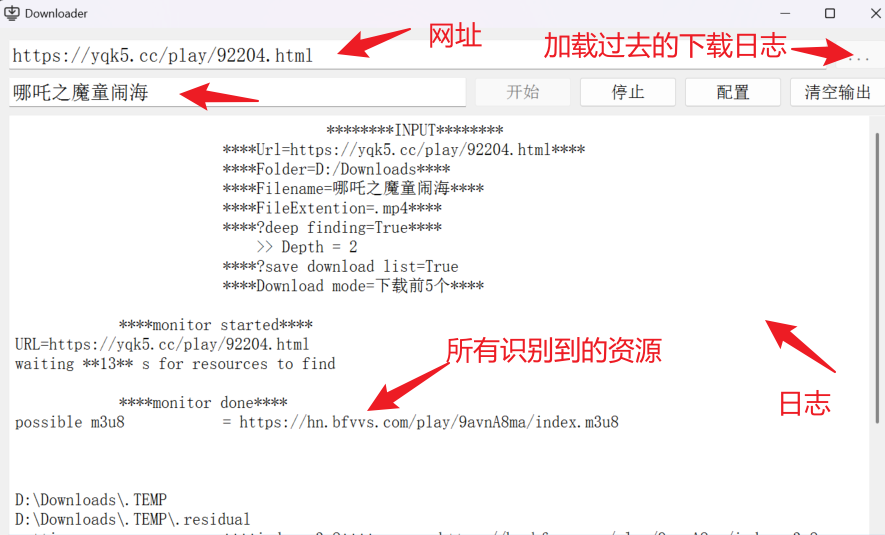
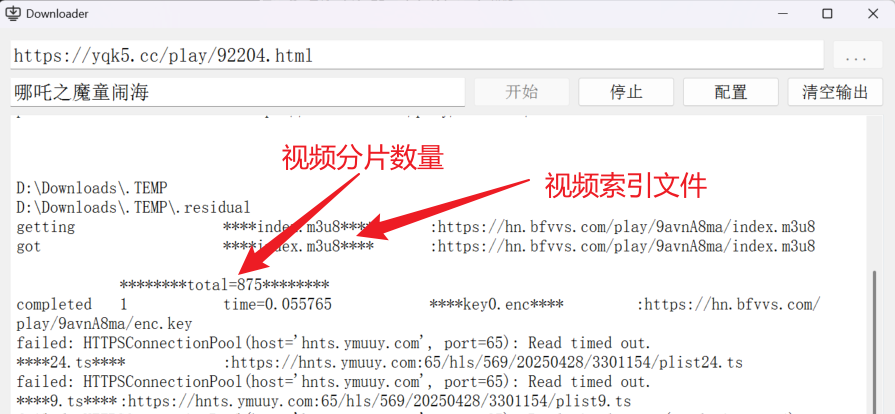
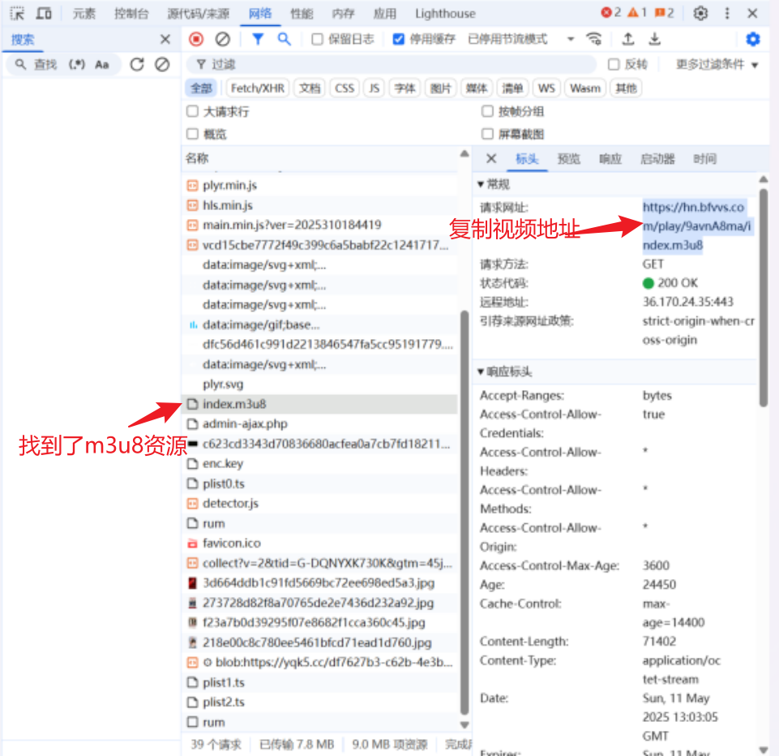
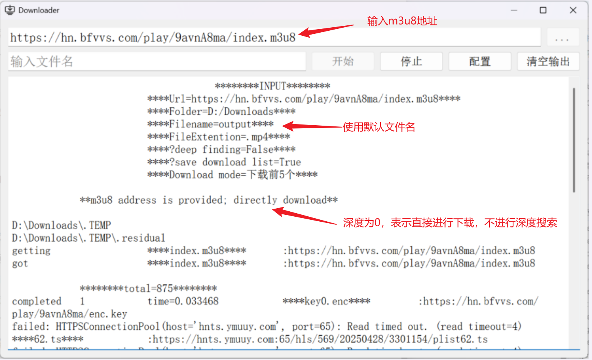

# m3u8网络视频下载器

## 项目简介

本项目基于 PyQt5 实现了一个图形化的 m3u8 下载器，支持从网页中监测 m3u8 资源并下载，也支持直接输入 m3u8 地址下载。下载过程使用并行分片，并保留每次下载日志，便于后续重载继续下载。

## 项目说明

- 本项目只针对 m3u8 视频下载。
- 下载过程包含失败列表和重试机制：重试轮次由下载器按分片规模和“首轮下载后的失败分片数”自适应扩展（有硬上限和提前停止保护）。
- 支持代理（可用于监测页面和分片下载）。
- 支持 URL 规则批量展开，一次输入可下载一组地址（见 `docs/URLDecode.md`）。

## 功能特性

- **图形化界面**：基于 PyQt5，操作直接。
- **地址规则解析**：支持范围与列表规则展开，批量下载。
- **并行下载**：分片下载线程数可配置（最大并行数量）。
- **下载日志**：每次任务写入 `Data/*.json`，可重新加载。
- **断点续跑**：加载历史日志后可继续处理未完成项。
- **递归探测**：可设置递归层数，控制从页面中提取链接后的继续探测层级。
- **资源预测**：针对已发现 m3u8，自动尝试常见文件名（如 `index.m3u8`、`mixed.m3u8`）。
- **规则化站点交互**：支持通过 JSON 配置站点专属点击/滚动/键盘动作，提高复杂站点抓取成功率。
- **多格式输出**：支持 `.mp4/.mov/.avi/.m4a/.flv/.mkv`。
- **实时日志输出**：主窗口输出识别、下载、重试与合成过程。

## 配置说明

当前配置窗口为 `ConfigTabWindow`，按逻辑分为 `常规` / `存储` / `下载` 三个 Tab。

### 常规 Tab

| 选项 | 含义 | 默认值 |
| :-- | :-- | :-- |
| 停止方式 | `阶段停止` / `强制重启` / `强制退出` | 阶段停止 |
| 使用代理 | 是否启用代理 | 关闭 |
| 代理地址 | 代理服务器地址 | `127.0.0.1` |
| 代理端口 | 代理服务器端口 | `7897` |
| 用户名/密码 | 代理认证信息（可选） | 空 |

### 存储 Tab

| 选项 | 含义 | 默认值 |
| :-- | :-- | :-- |
| 存储目录 | 下载输出目录 | `./m3u8` |
| 默认文件名 | 未填写文件名时使用 | `output` |
| 输出扩展名 | ffmpeg 合成输出扩展 | `.mp4` |

### 下载 Tab

| 选项 | 含义 | 默认值 |
| :-- | :-- | :-- |
| 递归探测层数 | 控制递归层数（1-6，1表示仅探测输入URL） | 关闭，2 |
| 探测尝试次数 | 每个 URL 的嗅探尝试次数 | 开启，2 |
| 浏览器交互 | 是否执行 `config/monitor.rules.json` 动作链 | 开启 |
| 无界面探测 | 监测阶段是否隐藏浏览器窗口 | 开启 |
| 下载方式 | 不下载 / 下载首个 / 下载前5个 / 下载所有 | 下载首个 |
| 最大并行数量 | 分片下载线程池上限（1-999） | 100 |
| 保存/加载下载预设 | 读写下载 Tab 预设 JSON | 默认目录 `config/preset` |

配置文件采用严格字段校验：`config/config.json` 字段不匹配时会备份为 `*.broken-时间戳`，并重建默认配置。

### 运行中配置生效时机（批量任务）

- 批量输入（如 `{{idx:1-5}}`）展开后，每个 URL 会作为一个独立任务顺序执行。
- 每个 URL 任务开始前，程序会重新读取一次 `config/config.json`，刷新该 URL 的运行参数。
- 当前正在执行的 URL 使用“开始时快照”，下载中途不会切换参数，保证当前任务稳定性。
- 你在下载过程中点“应用/确定”修改配置后，不会影响当前 URL；会从下一个尚未开始的 URL 生效。
- “停止方式”属于例外：点击停止按钮时会读取当下配置，因此可以立即按新设置执行（阶段停止 / 强制重启 / 强制退出）。
- 若本次读取配置失败，当前 URL 会回退到本次下载线程已有的配置快照继续执行，不中断任务。

### 高级监测规则（手动配置）

- 在 `config/config.json` 设置 `monitorRulesPath`，默认值：`"monitorRulesPath": "config/monitor.rules.json"`。
- 规则支持按域名/URL 匹配，并配置点击、滚动、键盘等动作。
- 推荐统一写法：每个动作使用 `type + when + args`（详见 `docs/MONITOR_RULES.md`）。
- 详细字段说明见：`docs/MONITOR_RULES.md`
- 文档示例见：`docs/monitor.rules.example.json`（示例文件不会作为运行时写入目标）
- 若规则文件不存在，程序会自动创建默认文件；若字段不符合当前严格 schema，会备份为 `*.broken-时间戳` 并重建。

### 关于下载列表日志

- “存储下载列表”选项已移除，当前逻辑为**固定保存日志**。
- 每个待解析 URL（例如 `{{idx:1,2}}` 的每个 idx）会各自产生一对文件：  
  `Data/day-yy.mm.dd;time-hh.mm.ss.json` + `Data/day-yy.mm.dd;time-hh.mm.ss.log`。
- 文件名时间取该 URL 开始处理时刻；若同一秒内重名，会自动补 `-1/-2...` 后缀避免覆盖。
- `.json` 用于重载继续下载，`.log` 为完整日志（包含界面“简洁显示”过滤掉的 `completed` 行）。
- `.json` 会在“监测完成、下载开始前”先落盘（默认全 `completed=false`），随后每完成一个候选下载就实时更新一次。
- 每个候选会额外记录 `failedSegments`（重试后仍失败的分片名和URL）、`segmentStats`、`completionMetrics` 与 `status`，方便后续排查和手动重跑。

### 进度条说明

- `查找进度`：当前 URL 的监测进度，按 `monitorTries` 的每次尝试与内部步骤逐步推进到 100%。
- `下载进度`：当前正在处理的单个 m3u8 的分片进度，按 `成功分片数 / 总分片数` 计算。
- `总进度`：按 URL 维度汇总（批量输入时每个 URL 等权），每个 URL 内部采用加权公式：  
  `总进度(单URL) = 查找阶段 * 25% + 下载阶段 * 75%`。
- `总进度` 的 25% 区间对应监测阶段，75% 区间对应下载阶段；这样更贴近实际耗时占比。
- 下载模式影响总进度下载阶段分母：  
  `下载所有` 按全部候选计算，`下载首个/前5个` 按目标成功视频数计算（失败会继续尝试下一候选）。
- 进度条采用单向递增策略，避免因为重试或状态切换出现回退。

### 嗅探参数说明（按当前代码）

| 参数 | 作用 |
| :-- | :-- |
| recursionDepth | 控制递归层数（1-6） |
| monitorTries | 每个 URL 的嗅探尝试次数 |
| monitorInteraction | 是否执行页面交互动作链 |

说明：

- 尝试次数是网页监测阶段的重复尝试次数，不等于分片失败重试次数。
- 递归层数与尝试次数、浏览器交互相互独立。
- 当 `monitorInteraction=true` 时，隐藏资源触发包括模拟播放、滚动、键盘/鼠标操作等页面动作。
- 下载方式“下载首个/下载前5个”按“真实成功视频数量”计数，失败候选会自动跳过并继续尝试后续候选。
- 分片失败重试由下载器内部独立处理。
- 候选完成判定支持“少量分片缺失容忍”，具体阈值与字段见：`docs/DOWNLOAD_RETRY_STRATEGY.md`。
- 分片缺失容忍阈值是下载器内部固定策略：`maxMissingSegments=2`、`minSuccessRatio=0.995`（定义于 `UI/MyWindow.py` 的 `completion_policy`），当前不提供设置界面配置。
- 分片重试与超时自适应策略详见：`docs/DOWNLOAD_RETRY_STRATEGY.md`。

## 地址规则说明

- 示例1：`https://example.com/single_file`（不使用规则）
- 示例2：`https://example.com/images/pic_{{idx}}.{{type}} {{idx:1-5}} {{type:jpg,m3u8,png}}`
  - `idx`：数字范围
  - `type`：列表枚举

详细说明： [关于URL解析的解释](./docs/URLDecode.md)

## 使用说明

- 下载速度受站点与网络影响较大，高并发不一定更快。
- 体积较小的视频在“识别资源 + 重试分片”阶段也可能耗时明显，属于正常现象。

### 使用示例

1. 在网页中搜索 `哪吒2魔童闹海电影免费观看`
2. 点击进入站点 `https://yqk5.cc/play/92204.html`

#### 下载方式1（网页地址监测）

1. 复制网页地址并粘贴到下载器网址栏
2. 填写文件名
3. 点击开始下载
4. 观察输出日志中的资源识别和分片下载进度

#### 下载方式2（直接 m3u8 地址）

1. 打开浏览器开发者工具 -> 网络
2. 刷新页面，定位 `index.m3u8`
3. 复制 m3u8 地址（如 `https://hn.bfvvs.com/play/9avnA8ma/index.m3u8`）
4. 粘贴到输入框并开始下载
5. 若未填写文件名，则使用配置中的默认文件名 `output`

## 下载日志与重载

- 使用主界面 `...` 按钮可加载 `Data/*.json` 日志。
- 默认会优先按“未完成项”继续下载。
- 历史日志里的配置（目录、扩展名、代理、并行等）会一并参与该次任务。

## 代理与并行注意事项

- 代理开启后会同时用于：
  - 页面监测（Playwright）
  - m3u8 索引和分片下载（requests）
- 页面监测在“未开启代理”时会强制禁用系统代理，确保行为可预测。
- 最大并行数量越高，对 CPU/内存和目标站点压力越大，建议按机器与网络情况调整。

### 监测策略建议

- 如果看到 `ERR_BLOCKED_BY_CLIENT`：
  - 再关闭“监测无界面模式”，观察是否被点击后跳转到广告页。
- 若某站点始终无法触发播放器：
  - 使用 `monitorRulesPath` 配置该站点的专属动作（见 `docs/MONITOR_RULES.md`）。
- 仍需命令行覆盖时，可使用环境变量 `M3U8_MONITOR_HEADLESS=0/1`。
- 若提示 `Playwright was just installed or updated`，说明当前 Python 环境缺少浏览器内核，执行 `playwright install chromium`。

## 安装与运行

1. 安装依赖：`pip install -r requirements.txt`
2. 准备 `ffmpeg.exe` 并放在项目根目录
3. 运行：`python main.py`

## 打包

1. 在项目根目录打开 `cmd`
2. 执行：`build.bat`（脚本内部使用 `python -m nuitka --standalone`）
3. 打包产物输出到：`build/main.dist`
4. 若运行打包后的程序，确保 `ffmpeg.exe` 与 `main.exe` 位于同一目录（或当前工作目录）

## 已知问题

- **高并发**：并发设置过高可能导致 CPU/内存占用过高或线程异常。
- **反爬**：部分站点有更严格反爬策略，可能出现识别不到资源或分片请求失败。
- **cookies**：软件主要针对一些非官方的网站，使用cookies和高级反爬策略的网站较少。

